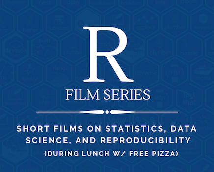

  

* * *

Please join Tuesday from 12 - 1 pm this spring for screenings of excellent talks from the recent [Rstudio::conf](https://rstudio.com/conference/). We'll be meeting in **Physics 123**. Many/most of these talks have useful gems even to folks with only limited exposure to programming and R.

Come for the talks, stay for the follow-up conversation (and free pizza)!

* * *

#### Community Work in Data Science - March 3rd
[Data science education as an economic and public health intervention in East Baltimore](https://resources.rstudio.com/rstudio-conf-2020/data-science-education-as-an-economic-and-public-health-intervention-in-east-baltimore-jeff-leek) - Jeff Leek  

*In what ways can Reedies get involved in data science for social good? How could the new stats/data science club be in a unique position to contribute?*

[The development of "datos" package for the R4DS Spanish translation](https://resources.rstudio.com/rstudio-conf-2020/the-development-of-datos-package-for-the-r4ds-spanish-translation-riva-quiroga-2?prevItm=0&prevCol=6275649&ts=58869) - Riva Quiroga

*Riza Quiroga mentioned several unique challenges that came up in the effort to translate R4DS to Spanish. Which were surprising to you? What are you still curious about?*

* * *

#### Debugging - March 10th
[Object of type ‘closure’ is not subsettable](https://resources.rstudio.com/rstudio-conf-2020/object-of-type-closure-is-not-subsettable-jenny-bryan) - Jenny Bryan

* * *

#### Data Visualization - March 17th
[Effective Visualizations](https://resources.rstudio.com/rstudio-conf-2020/effective-visualizations-miriah-meyer) - Miriah Meyer

[Glamour of Graphics](https://resources.rstudio.com/rstudio-conf-2020/the-glamour-of-graphics-william-chase) - Will Chase

* * *

#### No Session, Spring Break! - March 24th

* * *

#### Visualizing Equitable AI - March 31st
[Data, visualization, and designing AI](https://resources.rstudio.com/rstudio-conf-2020/data-visualization-and-designing-ai-fernanda-viegas-and-martin-wattenberg) - Fernanda Viegas \& Martin Wattenberg

* * *

#### Career Advice For Aspiring Data Scientists - April 7th
[Career Advice for Aspiring Data Scientists](https://resources.rstudio.com/rstudio-conf-2020/panel-career-advice-for-data-scientists-jen-hecht) - Gabriela de Queiroz, David Keyes, Sydeaka Watson, \& Jen Hecht 

* * *

#### Designing with RMarkdown - April 14th
[Of Teacup Giraffes and RMarkdown](https://resources.rstudio.com/rstudio-conf-2020/of-teacups-giraffes-and-r-markdown-desiree-de-leon) - Desirée De Leon

[RMarkdown Driven Development](https://resources.rstudio.com/rstudio-conf-2020/rmarkdown-driven-development-emily-riederer) - Emily Reiderer 
